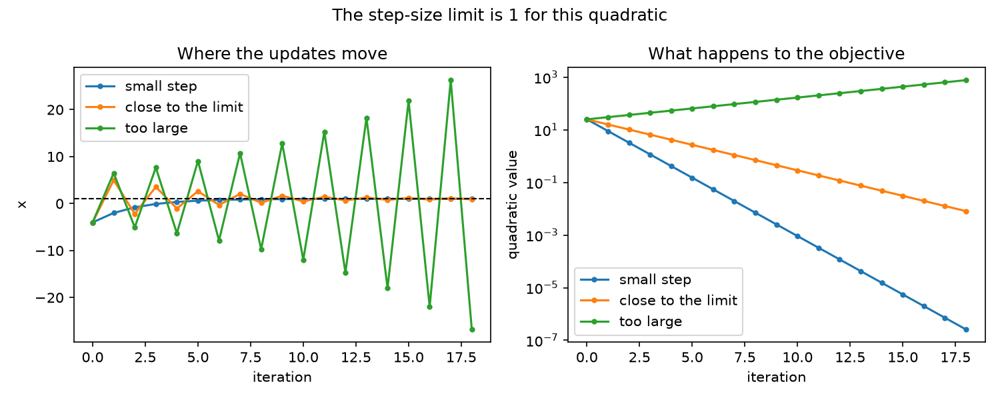

# Little Testings

This is a collection of small things I try while going through different
topics from university. Most of them are just short experiments to make the
ideas a bit more concrete.

## Estimating pi, logarithms, and e with random points

This started as a small Monte Carlo experiment for approximating pi. I added
two related experiments to see what else the same random-area idea can do.

The idea is simple: scatter 10,000 random points across the square
`[-1, 1] × [-1, 1]` and count how many fall inside the unit circle. The
circle covers `pi / 4` of the square, so multiplying that fraction by four
gives us an estimate of pi.

For a logarithm, the notebook counts points below `1/x`, since the area from
1 to a value is its natural logarithm. It then estimates Euler's number by
looking for the point where that accumulated area reaches 1.

## Try it yourself

```bash
python3 -m venv .venv
source .venv/bin/activate
python -m pip install -r requirements.txt
jupyter notebook monte_carlo_pi.ipynb
```

The notebook uses the fixed seed `42`, so you should get the same result each
time you run it.

## Vertex cover from a maximal matching

This is a small implementation of the 2-approximation for vertex cover that
uses a maximal matching. It takes any remaining edge, adds both endpoints to
the cover, and then removes the edges that are already covered.

It does not always find the smallest possible cover, but it is quite simple
and the result is never more than twice as large as an optimal cover.

Run the example with:

```bash
python3 maximal_matching_vertex_cover.py
```

The tests only use Python's standard library:

```bash
python3 -m unittest test_maximal_matching_vertex_cover.py
```

## Exact vertex cover on a tree

The approximation above works for general graphs, but on a tree it is possible
to find the actual smallest cover. This version roots the tree and stores two
answers for every vertex: what happens if the vertex is included and what
happens if it is left out.

The example uses the same graph for both vertex-cover methods. On this one the
matching approximation takes all four vertices, while the tree method only
needs two.

```bash
python3 tree_vertex_cover.py
python3 -m unittest test_tree_vertex_cover.py
```

## Independent sets and vertex covers

After the two vertex-cover examples, I wanted to check the connection with
independent sets. A set is independent when it never contains both ends of an
edge. This means its complement has to cover every edge.

The script checks all subsets of a small graph and finds both a largest
independent set and a smallest vertex cover. It also checks that their sizes
add up to the number of vertices. The exhaustive search gets slow quickly, so
this one is really only meant for small examples.

```bash
python3 independent_set_vertex_cover.py
python3 -m unittest test_independent_set_vertex_cover.py
```

## Trying different gradient descent step sizes

This is a one-dimensional gradient descent example with a quadratic whose
minimum is at `x = 1`. I ran the same update with a small step, one close to
the stability limit, and one just above it.

The small step settles down steadily. The step near the limit keeps crossing
over the minimum but still gets closer, while the too-large step slowly moves
away. The script prints the final values and saves a plot of all three runs.

```bash
python3 quadratic_gradient_descent.py
python3 -m unittest test_quadratic_gradient_descent.py
```



## Estimating an integral by averaging random heights

The pi/log notebook counted random points under a curve. This little follow-up
uses a different Monte Carlo trick: pick random x-values and average the
heights of `1/x` there. Multiplying by the interval width estimates the area
from 1 to 3, which is `ln(3)`.

The script prints estimates for a few sample sizes, a rough standard error,
and a midpoint-rule result for comparison. The random estimates do not have
to improve on every single run.

```bash
python3 monte_carlo_integral.py
python3 -m unittest test_monte_carlo_integral.py
```

## Learning a line with JAX

This is a first small JAX training example. There are only five made-up data
points and two things to learn: the slope and intercept of a line. JAX works
out the gradient of the squared error; the script then takes ordinary gradient
descent steps, like in the earlier quadratic example.

I also calculate the direct least-squares answer to check where the learning
loop ends up. The script prints the loss at the start, after 10 updates, and
after 80 updates. It is meant as a small setup to play with, not a serious
prediction model.

```bash
python3 -m pip install -r requirements.txt
python3 jax_linear_regression.py
python3 -m unittest test_jax_linear_regression.py
```
