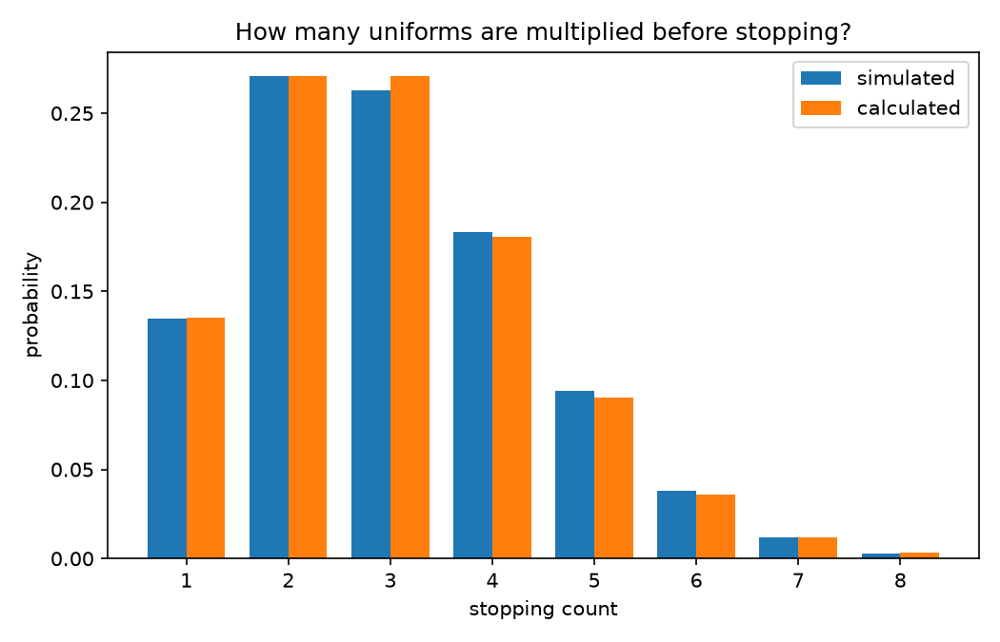

# Multiplying uniforms until the product is small

This experiment starts at 1 and keeps multiplying by random numbers between
0 and 1. It records how many draws are needed before the product falls below
a chosen threshold.

For the example I use `exp(-2)` as the threshold. Taking a negative logarithm
turns the product into a sum of exponential random variables. This means the
stopping count is one more than a Poisson random variable with mean 2, so its
mean should be 3 and its variance should be 2.

The script simulates 20,000 runs and puts the observed mean, variance, and
first eight probabilities beside those calculated values. It also saves a bar
chart so the two sets of probabilities are easier to compare. It deliberately
does not fix a seed, so the displayed numbers and bar heights move slightly
between runs. The tests use their own fixed seed so they stay repeatable.

From the main folder:

```bash
python3 -m monte_carlo.product_stopping_time.simulation
python3 -m unittest monte_carlo.product_stopping_time.test_simulation
```


